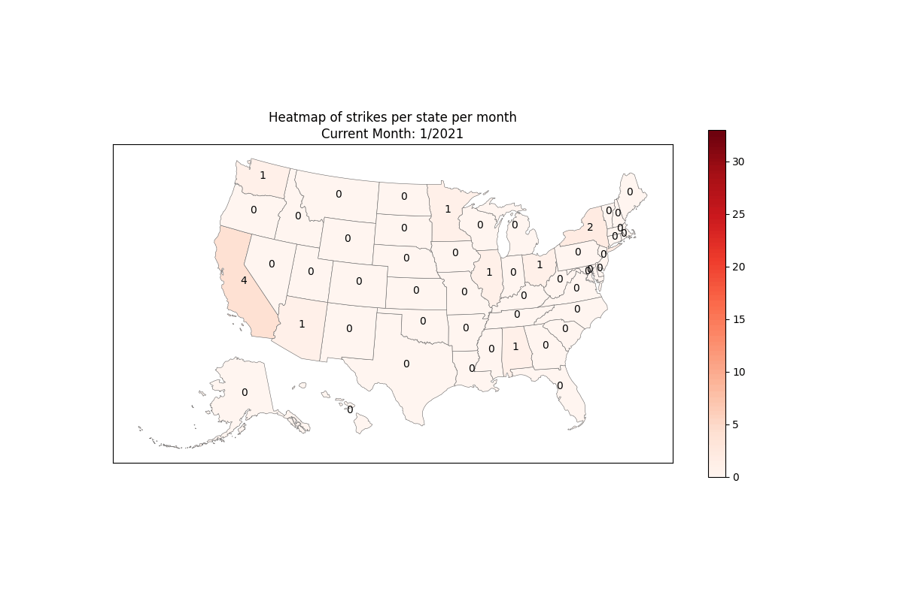

# Strike Heatmap

Working to create a time-based heatmap of strike activity in the United States

This will originally use information from the Cornell University ILR Labor Action Tracker. They have a real-time map of labor actions. 

Additionally, using data from the historical FMCS archive now located [here](https://github.com/labordata/fmcs-work-stoppage). This data goes up until 2020 when FMCS stopped posting it publicly. 

Current Heatmap:

Roadmap:
- [x] Ingest data from ILR tracker
- [ ] Ingest data from FMCS csv
- [x] Draw a test map of the US using Python
- [x] Combine map and data to make heatmap
- [x] Make gif out of maps per month
- [ ] Use more data than just ILR tracker to get more historical strike trends
- [ ] Number of actions by congressional district
- [ ] Setup Github Actions to run the scripts weekly to produce new gif